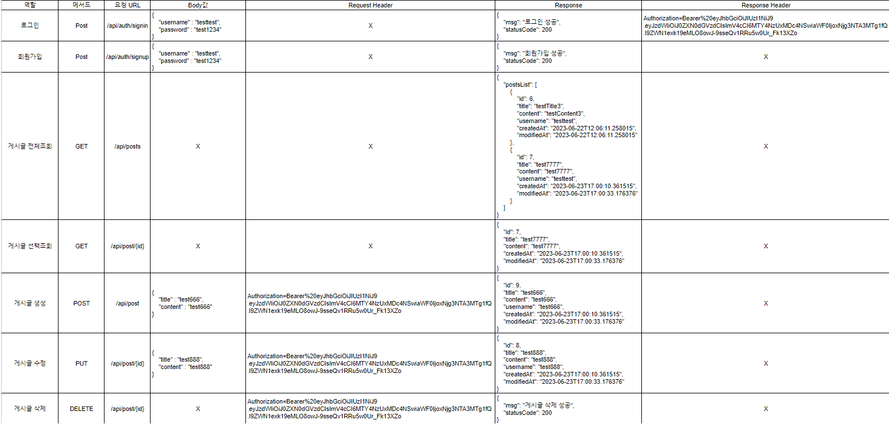

1. API

2. ERD를 먼저 설계한 후 Entity를 개발했을 때 어떤 점이 도움이 되셨나요?
-
3. JWT를 사용하여 인증/인가를 구현 했을 때의 장점은 무엇일까요?
-
4. 반대로 JWT를 사용한 인증/인가의 한계점은 무엇일까요?
-
5. 만약 댓글 기능이 있는 블로그에서 댓글이 달려있는 게시글을 삭제하려고 한다면 무슨 문제가 발생할까요? Database 테이블 관점에서 해결방법이 무엇일까요?
-
6. IoC / DI 에 대해 간략하게 설명해 주세요!
-