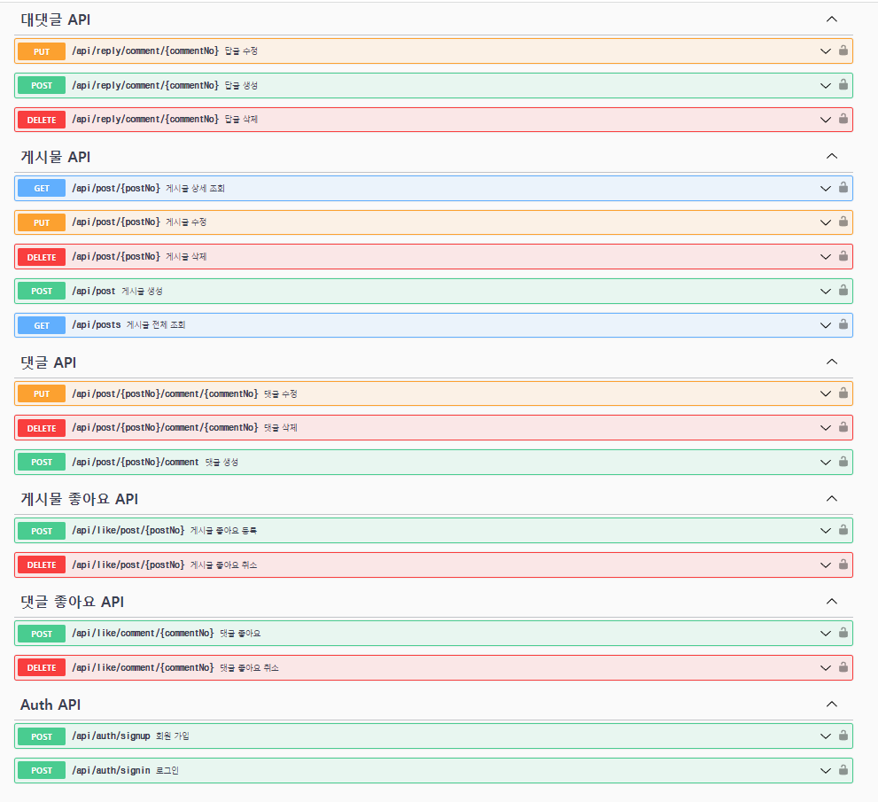

1. API

- 서버 실행 시킨 후 Swagger 주소.
- http://localhost:8080/swagger-ui/index.html#/
2. Spring Security를 적용했을 때 어떤 점이 도움이 되셨나요?
- 인증을 받지 않은 유저는 특정 API에 접속을 허용하지 않는다는 점이 좋았습니다. (권한 포함)
3. Spring Security를 사용하지 않는다면 어떻게 인증/인가를 효율적으로 처리할 수 있을까요?
- AOP를 활용하여 특정 메서드 또는 클래스에 대한 인증 또는 인가 로직을 구현할 수 있습니다
4. AOP에 대해 설명해 주세요!
- AOP에서는 어드바이스를 특정 지점에 적용하는 방법으로 "위빙(Weaving)"이라는 개념을 사용. 위빙은 컴파일 시점, 클래스 로딩 시점, 실행 시점 등 다양한 시점에 어드바이스를 타겟 코드에 삽입하여 실행될 수 있도록 한다.
5. 즉시로딩 / 지연로딩에 대해 설명해 주세요!
- 즉시로딩 -> 연관된 객체들을 한 번에 모두 로드하는 방식
- 지연로딩 -> 연관된 객체를 실제로 필요로 할 때 로드하는 방식