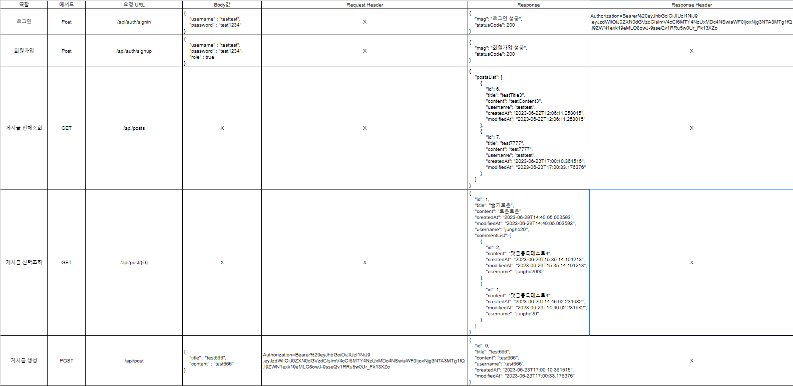
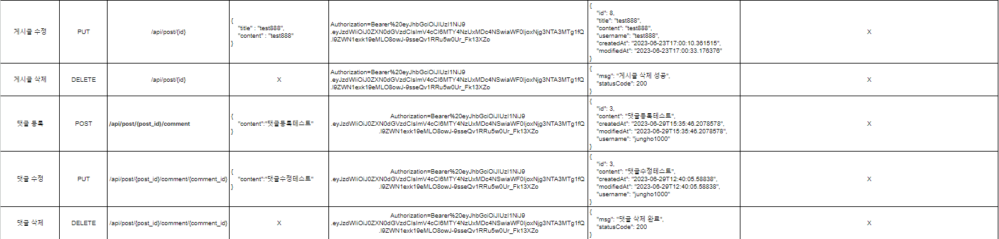

1. API
- Token 값은 User가 로그인 할때마다 변경

2. ERD를 먼저 설계한 후 Entity를 개발했을 때 어떤 점이 도움이 되셨나요?
- 설계한 ERD를 보고 Entity를 개발할 때 막히지 않고 수월하게 코드를 작성해 나간점이 도움이 되었습니다.
3. JWT를 사용하여 인증/인가를 구현 했을 때의 장점은 무엇일까요?
- 확장성: JWT는 토큰 기반의 인증 방식으로, 서버의 세션 상태를 유지하지 않습니다. 이는 서버의 확장성을 향상시키고 여러 서버 간의 인증 정보를 공유할 수 있는 유연한 아키텍처를 제공합니다.
- 무상태(Stateless): 서버에 세션 정보를 저장하지 않으므로, 서버 측에서 세션 관리에 대한 부담이 없어집니다. 클라이언트가 토큰을 포함하여 요청하면 서버는 토큰을 검증하여 인증을 수행하며, 필요한 정보를 토큰에서 추출하여 사용할 수 있습니다.
4. 반대로 JWT를 사용한 인증/인가의 한계점은 무엇일까요?

- 토큰 만료 관리: JWT는 토큰 자체에 만료 시간을 포함시킵니다. 만료된 토큰은 더 이상 유효하지 않으며, 클라이언트는 새로운 토큰을 요청해야 합니다. 이로 인해 토큰의 유효 시간 관리와 새로운 토큰 발급에 대한 추가적인 로직이 필요합니다.
- 토큰 재발급과 강제 로그아웃: JWT는 한 번 발급된 토큰은 서버에서 강제로 만료시킬 수 없습니다. 따라서 토큰을 강제로 만료시키기 위해서는 추가적인 매커니즘을 구현해야 합니다. 또한, 토큰이 탈취되거나 보안 위협이 있는 경우에도 토큰을 강제로 만료시킬 수 있는 방법이 필요합니다.
5. 만약 댓글 기능이 있는 블로그에서 댓글이 달려있는 게시글을 삭제하려고 한다면 무슨 문제가 발생할까요? Database 테이블 관점에서 해결방법이 무엇일까요?
- 댓글은 게시글에 대한 참조(외래 키)를 가지고 있을 가능성이 높습니다. 게시글을 삭제하면 댓글이 참조하는 게시글이 존재하지 않게 되므로, 데이터베이스의 무결성 제약 조건에 위배됩니다.
- 해결 방법으로는 게시글과 댓글을 연결하는 외래 키에 ON DELETE CASCADE 옵션을 추가하여 관련된 댓글들이 자동으로 삭제되도록 하는 방법이 있습니다.
6. IoC / DI 에 대해 간략하게 설명해 주세요!
- IoC (Inversion of Control)은 제어의 역전을 의미합니다. 기존에는 개발자가 코드의 흐름과 제어를 직접 관리하였지만, IoC는 개발자가 제어의 흐름을 위임하고 필요한 시점에 호출되도록 하는 디자인 패턴입니다.

- IoC의 핵심 개념 중 하나는 DI (Dependency Injection)입니다. DI는 의존성 주입을 의미하며, 객체 간의 의존 관계를 외부에서 주입하여 결합도를 낮추고 유연한 코드를 작성할 수 있게 해줍니다. DI는 주로 생성자를 통해 의존하는 객체를 주입하거나, Setter 메서드를 통해 의존 객체를 주입하는 방식으로 이루어집니다.
